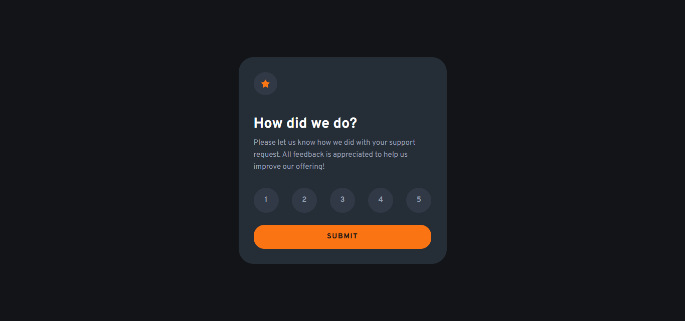
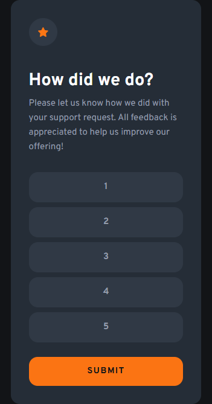

# ⭐ Interactive Rating Component

A sleek, **fully interactive** rating component built with **HTML, CSS, and JavaScript**. This project allows users to select a rating and submit their feedback dynamically.  

## 🛰 Live Demo  
🔗 [View Project](https://bhavikthakur.github.io/interactive-rating-component/)  

---

## 🚀 Features
✔️ **Interactive Rating System** – Users can select a rating from 1 to 5.  
✔️ **Dynamic UI Updates** – The selected rating is displayed after submission.  
✔️ **Error Handling** – Displays an error message if the user tries to submit without selecting a rating.  
✔️ **Smooth Animations** – Transitions and hover effects enhance the user experience.  
✔️ **Responsive Design** – Works seamlessly across different screen sizes.  

---

## 🎯 Technologies Used
- **HTML5** – Semantic markup  
- **CSS3** – Custom styles, responsive design, and smooth transitions  
- **JavaScript (ES6+)** – DOM manipulation and event handling  

---

## 📸 Preview  
  
   

---

## 📂 Folder Structure  
/project-folder <br>
│── /css <br>
│   ├── reset.css        # Resets default browser styles <br>
│   ├── styles.css       # Main styling file <br>
│   ├── media-queries.css # Responsive styles <br>
│── /images             # Contains all images & icons <br>
│── index.html          # Main HTML file <br>
│── README.md           # Documentation <br>

## 🔧 Setup & Usage  
1. Clone this repository:  
   ```bash
   git clone https://github.com/bhavikthakur/interactive-rating-component.git   
2. Open index.html in your browser. 

## 🎥  How it works  
Click on a rating (1-5). <br>
The selected rating highlights are in orange. <br>
Click Submit to confirm your choice. <br>
A thank-you message appears with your rating. <br>
If no rating is selected, an error message is displayed. <br>

 ## 👩‍💻 Future Improvements
🔹 Add a dark mode toggle <br>
🔹 Store ratings in localStorage <br>
🔹 Implement backend support to save user feedback <br>

## 🤝 Connect With Me  
👨‍💻 GitHub: [bhavikthakur](https://github.com/bhavikthakur)  <br>
💼 LinkedIn: [Bhavik Thakur](https://www.linkedin.com/in/bhavik-thakur/)  <br>
🐦 Twitter: [Bhavik Thakur](https://x.com/BhavikkThakur)  <br>
